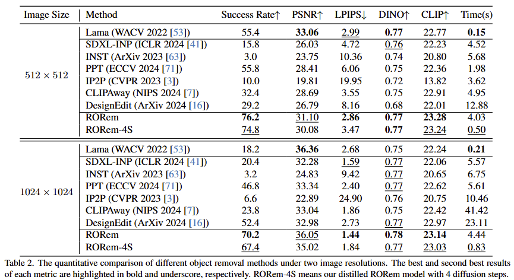

# RORem: Training a Robust Object Remover with Human-in-the-Loop

<a href='https://arxiv.org/abs/2501.00740'></a>

[Ruibin Li](https://github.com/leeruibin)<sup>1,2</sup>
| [Tao Yang](https://github.com/yangxy)<sup>3</sup> | 
[Song Guo](https://scholar.google.com/citations?user=Ib-sizwAAAAJ&hl=en)<sup>4</sup> | 
[Lei Zhang](https://scholar.google.com/citations?user=wzdCc-QAAAAJ&hl=en)<sup>1,2</sup> | 

<sup>1</sup>The Hong Kong Polytechnic University, <sup>2</sup>OPPO Research Institute, <sup>3</sup>ByteDance, <sup>4</sup>The Hong Kong University of Science and Technology.

## ⏰ Update
The code and model will be ready soon.

⭐: If RORem is helpful to you, please help star this repo. Thanks! 🤗

## 🌟 Overview Framework


Overview of our training data generation and model training process. In stage 1, we gather 60K training triplets from open-source datasets to train an initial removal model. In stage 2, we apply the trained model to a test set and engage human annotators to select high-quality samples to augment the training set. In stage 3, we train a discriminator using the human feedback data, and employ it to automatically annotate high quality training samples. We iterate stages 2\&3 for several rounds, ultimately obtaining over 200K object removal training triplets as well as the trained model.


## 🌟 Visual Results

### Quantative comparsion

We invite human annotators to evaluate the success rate of different methods. Furthermore, by refining our discriminator, we can see that the success rates estimated by $D_{\phi}$ closely align with human annotations in the test set (with deviations less than 3% in most cases). This indicates that our trained $D_{\phi}$ effectively mirrors human preferences.



### Qualitative Comparisons


<!-- ### Citations
If our code helps your research or work, please consider citing our paper.
The following are BibTeX references: -->

### License
This project is released under the [Apache 2.0 license](LICENSE).

## BibTeX

```bibtex
@article{li2024RORem,
  title={RORem: Training a Robust Object Remover with Human-in-the-Loop},
  author={Ruibin Li and Tao, Yang and Song, Guo and Lei, Zhang},
  year={2024},
  journal={arXiv preprint arXiv:2501.00740},
}
```

<details>
<summary>statistics</summary>


</details>