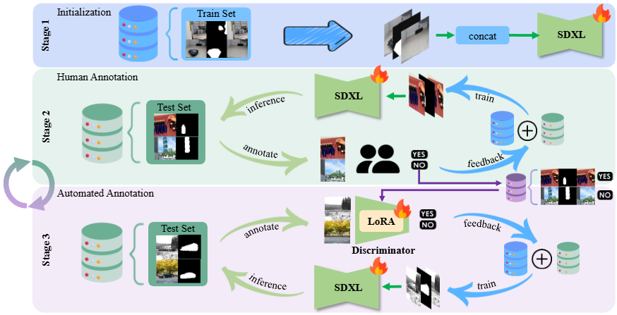

# RORem: Training a Robust Object Remover with Human-in-the-Loop

<a href='https://arxiv.org/abs/2501.00740'></a>

[Ruibin Li](https://github.com/leeruibin)<sup>1,2</sup>
| [Tao Yang](https://github.com/yangxy)<sup>3</sup> | 
[Song Guo](https://scholar.google.com/citations?user=Ib-sizwAAAAJ&hl=en)<sup>4</sup> | 
[Lei Zhang](https://scholar.google.com/citations?user=wzdCc-QAAAAJ&hl=en)<sup>1,2</sup> | 

<sup>1</sup>The Hong Kong Polytechnic University, <sup>2</sup>OPPO Research Institute, <sup>3</sup>ByteDance, <sup>4</sup>The Hong Kong University of Science and Technology.

⭐: If RORem is helpful to you, please help star this repo. Thanks! 🤗

## 📌 Progress Checklist
<!-- ✅ -->

- [x] **✅ RORem Dataset**  
- [x] **✅ Training Code**  
- [x] **✅ Inference Code**  
- [x] **✅ RORem Model, LoRA, Discriminator**  
- [x] **✅ RORem Diffuser**  
- [ ] **⬜️ Update Dataset to Hugging Face**  
- [ ] **⬜️ Create Hugging Face Demo**  
- [ ] **⬜️ Simplify Inference Code**  

## 😃 prepare enviroment

```
git clone https://github.com/leeruibin/RORem.git
cd RORem
conda env create -n environment.yaml
conda activate RORem
```

Install xformers to speedup the training, note that the xformers version should match torch version.

```
pip install xformers==0.0.28.post3
```

We use wandb to record the intermediate state during the training process, so make sure you finish the following process

```
pip install wandb
wandb login
```
enter the WANDB_API_KEY in the shell or direct export WANDB_API_KEY=<your-api-key> to the environment variable.

## ⭐ Download RORem dataset

| Dataset    |  Download                                                  |
| -----------| --------------------------------------------               |
| RORem&RORD | [Google cloud](https://drive.google.com/file/d/1sE6IOhHNCKiwFLW4a2ZWcwU4_bhvGcSA/view?usp=sharing) (73.15GB) |
| Mulan      | [Google cloud](https://drive.google.com/file/d/1-dX5GfxyGEGBSfFeBgl5vMH9ODdCpbuq/view?usp=sharing) (3.26GB) |
| Final HR   | [Google cloud](https://drive.google.com/file/d/1S3p_yLjPuhZbh7S15actNaAOEPvUlW5C/view?usp=sharing) (7.9GB) |

Please note that we employed the SafeStableDiffusionSafetyChecker to filter out inappropriate content, which may result in minor discrepancies between the final image-text pairs and those presented in the original paper.

For each dataset, we build folder structure as:

```
.
├── source
├── mask
├── GT
└── meta.json #
```
The meta.json file record the triple as:
```
{"source":"source/xxx.png","mask":"mask/xxx.png","GT":"GT/xxx.png"}
```

By path the absolute path of meta.json, the training script can parse the path of each triple.

## 🔥 Inference

| Model Checkpoint    |  Download                                                  |
| -----------| --------------------------------------------               |
| RORem | [Google cloud](https://drive.google.com/drive/folders/1-ZOLMkifypR2SW0n4pOw6_0iIuHu2Ovy?usp=drive_link) |
| RORem-mixed | [Google cloud](https://drive.google.com/drive/folders/1G46Rs0-fZvoJ55OLQrC35dbRohFM917z?usp=drive_link) |
| RORem-LCM      | [Google cloud](https://drive.google.com/drive/folders/1QK8qcqT7SKRzD2AyGtgfwWwlQrUesAc1?usp=drive_link)|
| RORem-Discriminator      | [Google cloud](https://drive.google.com/drive/folders/1ka3tN_hEeP1QR2CU81Uf9QM1JBHdDvc2?usp=drive_link)|

### RORem Diffuser

```
from diffusers import AutoPipelineForInpainting
from myutils.img_util import dilate_mask

resolution = 512
dilate_size = 20
use_CFG = True
pipe_edit = AutoPipelineForInpainting.from_pretrained(
        "LetsThink/RORem",
        torch_dtype=torch.float16, 
        variant="fp16"
    )
input_image = load_image(input_path).resize((resolution,resolution))
input_mask = load_image(mask_path).resize((resolution,resolution))
if args.dilate_size != 0:
    mask_image = dilate_mask(mask_image,dilate_size)
height = width = resolution
if not args.use_CFG:
    prompts = ""
    Removal_result = pipe_edit(
            prompt=prompts,
            height=height,
            width=width,
            image=input_image,
            mask_image=input_mask,
            guidance_scale=1.,
            num_inference_steps=50,  # steps between 15 and 30 also work well
            strength=0.99,  # make sure to use `strength` below 1.0
        ).images[0]
else:
    # we also find by adding these prompt, the model can work even better
    prompts = "4K, high quality, masterpiece, Highly detailed, Sharp focus, Professional, photorealistic, realistic"
    negative_prompts = "low quality, worst, bad proportions, blurry, extra finger, Deformed, disfigured, unclear background"
    Removal_result = pipe_edit(
            prompt=prompts,
            negative_prompt=negative_prompts,
            height=height,
            width=width,
            image=input_image,
            mask_image=input_mask,
            guidance_scale=1.,
            num_inference_steps=50,  # steps between 15 and 30 also work well
            strength=0.99,  # make sure to use `strength` below 1.0
        ).images[0]


```

### Run RORem
To run RORem inference, prepare an input image and a mask image, then run:

```
python inference_RORem.py
    --pretrained_model diffusers/stable-diffusion-xl-1.0-inpainting-0.1
    --RORem_unet xxx # RORem unet checkpoint
    --image_path xxx.png
    --mask_path xxx_mask.png
    --save_path result/output.png
    --use_CFG true
    --dilate_size 0 # optional: dilate the mask 
```
Here, we present two versions of RORem UNet:  
- The **[RORem](https://drive.google.com/drive/folders/1-ZOLMkifypR2SW0n4pOw6_0iIuHu2Ovy?usp=drive_link)** model, which achieves optimal performance with an image resolution of 512x512.  
- The **[RORem-mixed](https://drive.google.com/drive/folders/1G46Rs0-fZvoJ55OLQrC35dbRohFM917z?usp=drive_link)** model, trained on a mixed resolution of 512x512 and 1024x1024, delivers superior performance when processing images larger than 512x512.  

Additionally, we have observed that incorporating content-irrelevant prompts and leveraging Classifier-Free Guidance (CFG) further enhances removal performance, surpassing the results reported in the original paper.

### Run RORem-4S
To run RORem-4S inference, download the **[RORem-LCM](https://drive.google.com/drive/folders/1QK8qcqT7SKRzD2AyGtgfwWwlQrUesAc1?usp=drive_link)** LoRA, then run:

```
python inference_RORem_4S.py
    --pretrained_model diffusers/stable-diffusion-xl-1.0-inpainting-0.1
    --RORem_unet xxx # RORem unet checkpoint
    --RORem_LoRA xxx # RORem LoRA checkpoint
    --image_path xxx.png
    --mask_path xxx_mask.png
    --inference_steps 4
    --save_path result/output.png
    --use_CFG true
    --dilate_size 0 # optional: dilate the mask 
```

### Run RORem-discriminator

To run RORem-discrminator, download the **[RORem-Discriminator](https://drive.google.com/drive/folders/1ka3tN_hEeP1QR2CU81Uf9QM1JBHdDvc2?usp=drive_link)**, then run:

```
python inference_RORem_discrminator.py
    --pretrained_model diffusers/stable-diffusion-xl-1.0-inpainting-0.1
    --RORem_discriminator xxx
    --image_path xxx.png
    --mask_path xxx_mask.png
    --edited_path xxx.png
```

## 🔥 Training

### To train RORem, with the following training script

```
accelerate launch \
    --multi_gpu \
    --num_processes 8 \
    train_RORem.py \
    --train_batch_size 16 \
    --output_dir <your_path_to_save_checkpoint> \
    --meta_path xxx/Final_open_RORem/meta.json \
    --max_train_steps 50000 \
    --random_flip \
    --resolution 512 \
    --pretrained_model_name_or_path diffusers/stable-diffusion-xl-1.0-inpainting-0.1 \
    --mixed_precision fp16 \
    --checkpoints_total_limit 5 \
    --checkpointing_steps 5000 \
    --learning_rate 5e-5 \
    --validation_steps 2000 \
    --seed 4 \
    --report_to wandb \
```

Using Deepspeed zero2 requires less GPU memory.

```
accelerate launch --config_file config/deepspeed_config.yaml \
    --multi_gpu \
    --num_processes 8 \
    train_RORem.py \
    --train_batch_size 16 \
    --output_dir <your_path_to_save_checkpoint> \
    --meta_path xxx/Final_open_RORem/meta.json \
    --max_train_steps 50000 \
    --random_flip \
    --resolution 512 \
    --pretrained_model_name_or_path diffusers/stable-diffusion-xl-1.0-inpainting-0.1 \
    --mixed_precision fp16 \
    --checkpoints_total_limit 5 \
    --checkpointing_steps 5000 \
    --learning_rate 5e-5 \
    --validation_steps 2000 \
    --seed 4 \
    --report_to wandb \
```

OR you can directly submit the training shell as:

```
bash run_train_RORem.sh
```

### To train RORem-LCM, with the following training script

```
accelerate launch \
    train_RORem_lcm.py \
    --multi_gpu \
    --num_processes 8 \
    --pretrained_teacher_unet xxx \
    --output_dir experiment/RORem_LCM
```
OR you can directly submit the training shell as:
```
bash run_train_RORem_LCM.sh
```

### To train RORem-Discriminator, with the following training script

In order to train RORem-Discriminator, you should add "score" to each triple which will be 
```
[
{"source":"source/xxx.png","mask":"mask/xxx.png","GT":"GT/xxx.png", "score":1},
{"source":"source/xxx.png","mask":"mask/xxx.png","GT":"GT/xxx.png", "score":0},
]
```
Then you can directly submit the training shell as:
```
bash run_train_RORem_discriminator.sh
```

<!-- ## ⏰ Update
The code and model will be ready soon.
 -->


## 🌟 Overview Framework




Overview of our training data generation and model training process. In stage 1, we gather 60K training triplets from open-source datasets to train an initial removal model. In stage 2, we apply the trained model to a test set and engage human annotators to select high-quality samples to augment the training set. In stage 3, we train a discriminator using the human feedback data, and employ it to automatically annotate high quality training samples. We iterate stages 2\&3 for several rounds, ultimately obtaining over 200K object removal training triplets as well as the trained model.


## 🌟 Visual Results

### Quantative comparsion

We invite human annotators to evaluate the success rate of different methods. Furthermore, by refining our discriminator, we can see that the success rates estimated by $D_{\phi}$ closely align with human annotations in the test set (with deviations less than 3% in most cases). This indicates that our trained $D_{\phi}$ effectively mirrors human preferences.


### Qualitative Comparisons


<!-- ### Citations
If our code helps your research or work, please consider citing our paper.
The following are BibTeX references: -->

### License
This project is released under the [Apache 2.0 license](LICENSE).

## BibTeX

```bibtex
@article{li2024RORem,
  title={RORem: Training a Robust Object Remover with Human-in-the-Loop},
  author={Ruibin Li and Tao, Yang and Song, Guo and Lei, Zhang},
  year={2025},
  booktitle={IEEE/CVF Conference on Computer Vision and Pattern Recognition},
}
```

## Acknowledgements

This implementation is developed based on the [diffusers](https://github.com/huggingface/diffusers/) library, [LCM](https://github.com/huggingface/diffusers/blob/main/examples/consistency_distillation/train_lcm_distill_lora_sdxl_wds.py) and utilizes the [Stable Diffusion XL-inpainting](https://huggingface.co/diffusers/stable-diffusion-xl-1.0-inpainting-0.1) model. We would like to express our gratitude to the open-source community for their valuable contributions.

<details>

<summary>statistics</summary>


</details>